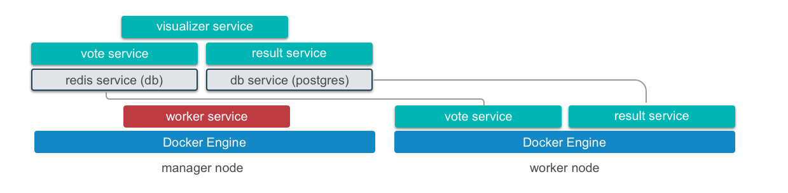

# 创建docker swarm应用

下面以docker官网上的创建[vote投票](https://docs.docker.com/engine/getstarted-voting-app/)示例来说明如何创建一个docker swarm的应用。

在进行如下步骤时，你需要保证已经部署并正常运行着一个docker swarm集群。

在这个应用中你将学到

- 通过创建``docker-stack.yml``和使用``docker stack deploy``命令来部署应用
- 使用``visualizer``来查看应用的运行时
- 更新``docker-stack.yml``和``vote``镜像重新部署和发布**vote** 应用
- 使用Compose Version 3



## 需要使用到的images

| Service   | 描述                                       | Base image                               |
| --------- | ---------------------------------------- | ---------------------------------------- |
| vote      | Presents the voting interface via port `5000`. Viewable at `:5000` | Based on a Python image, `dockersamples/examplevotingapp_vote` |
| result    | Displays the voting results via port 5001. Viewable at `:5001` | Based on a Node.js image, `dockersamples/examplevotingapp_result` |
| visulizer | A web app that shows a map of the deployment of the various services across the available nodes via port `8080`. Viewable at `:8080` | Based on a Node.js image, `dockersamples/visualizer` |
| redis     | Collects raw voting data and stores it in a key/value queue | Based on a `redis` image, `redis:alpine` |
| db        | A PostgreSQL service which provides permanent storage on a host volume | Based on a `postgres` image, `postgres:9.4` |
| worker    | A background service that transfers votes from the queue to permanent storage | Based on a .NET image, `dockersamples/examplevotingapp_worker` |

**用到的镜像有：**

- dockersamples/examplevotingapp_vote:before
- dockersamples/examplevotingapp_worker
- dockersamples/examplevotingapp_result:before
- dockersamples/visualizer:stable
- postgres:9.4
- redis:alpine

我们将这些images同步到我们的私有镜像仓库sz-pg-oam-docker-hub-001.tendcloud.com中。

镜像名称分别为：

- sz-pg-oam-docker-hub-001.tendcloud.com/library/examplevotingapp_vote:before
- sz-pg-oam-docker-hub-001.tendcloud.com/library/examplevotingapp_worker
- sz-pg-oam-docker-hub-001.tendcloud.com/library/examplevotingapp_result:before
- sz-pg-oam-docker-hub-001.tendcloud.com/library/visualizer:stable
- sz-pg-oam-docker-hub-001.tendcloud.com/library/postgres:9.4
- sz-pg-oam-docker-hub-001.tendcloud.com/library/redis:alpine

## 使用V3版本的compose文件##

[v3版本的compose与v2版本的区别](compose_v2v3.md)

docker-stack.yml配置

```Yaml
version: "3"
services:

  redis:
    image: sz-pg-oam-docker-hub-001.tendcloud.com/library/redis:alpine
    ports:
      - "6379"
    networks:
      - frontend
    deploy:
      replicas: 2
      update_config:
        parallelism: 2
        delay: 10s
      restart_policy:
        condition: on-failure
  db:
    image: sz-pg-oam-docker-hub-001.tendcloud.com/library/postgres:9.4
    volumes:
      - db-data:/var/lib/postgresql/data
    networks:
      - backend
    deploy:
      placement:
        constraints: [node.role == manager]
  vote:
    image: sz-pg-oam-docker-hub-001.tendcloud.com/library/examplevotingapp_vote:before
    ports:
      - 5000:80
    networks:
      - frontend
    depends_on:
      - redis
    deploy:
      replicas: 2
      update_config:
        parallelism: 2
      restart_policy:
        condition: on-failure
  result:
    image: sz-pg-oam-docker-hub-001.tendcloud.com/library/examplevotingapp_result:before
    ports:
      - 5001:80
    networks:
      - backend
    depends_on:
      - db
    deploy:
      replicas: 2
      update_config:
        parallelism: 2
        delay: 10s
      restart_policy:
        condition: on-failure

  worker:
    image: sz-pg-oam-docker-hub-001.tendcloud.com/library/examplevotingapp_worker
    networks:
      - frontend
      - backend
    deploy:
      mode: replicated
      replicas: 1
      labels: [APP=VOTING]
      restart_policy:
        condition: on-failure
        delay: 10s
        max_attempts: 3
        window: 120s

  visualizer:
    image: sz-pg-oam-docker-hub-001.tendcloud.com/library/visualizer:stable
    ports:
      - "8080:8080"
    stop_grace_period: 1m30s
    volumes:
      - "/var/run/docker.sock:/var/run/docker.sock"
    deploy:
      placement:
        constraints: [node.role == manager]

networks:
  frontend:
  backend:

volumes:
  db-data:
```

